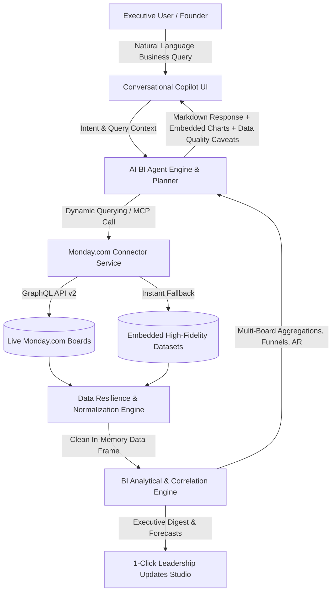

# 🚁 Skylark Drones — Monday.com Executive Business Intelligence Agent

[](https://skylark-monday-bi-agent-iota.vercel.app/)
[](https://github.com/SANJEEV02372/skylark-monday-bi-agent)
[](https://react.dev/)
[](https://vitejs.dev/)
[](https://tailwindcss.com/)
[](https://api.monday.com/v2)
[](https://modelcontextprotocol.io/)

An executive-grade AI Business Intelligence Agent designed for founders and leadership at Skylark Drones. It answers complex, multi-board business queries across Monday.com **Deals Pipeline** and **Work Order Execution** boards with dynamic GraphQL API integration, automated data resilience, real-time quality auditing, interactive visualizations, and one-click Leadership Briefings.

---

## 🌐 Live Access Links

- **🚀 Hosted Live Prototype**: [https://skylark-monday-bi-agent-iota.vercel.app](https://skylark-monday-bi-agent-iota.vercel.app)
- **📁 GitHub Source Code**: [https://github.com/SANJEEV02372/skylark-monday-bi-agent](https://github.com/SANJEEV02372/skylark-monday-bi-agent)
- **📑 Decision Log**: [`DECISION_LOG.md`](file:///c:/Users/sanje/fullstack/DECISION_LOG.md) (Detailed 2-page architectural rationale & trade-offs)

---

## 🎯 Problem Statement & Challenge

Founders and executives face critical data fragmentation when evaluating business health across sales and operations:
1. **Multi-Board Fragmentation**: Pipeline data lives in the *Deals Board* while execution, billing, and cash collection live in the *Work Order Tracker*.
2. **Messy Real-World Data**: Mixed date formats (Excel serial dates like `45808`), corrupt financial values (`#VALUE!`), inconsistent sector naming (`Renewable` vs `Solar` vs `Green Energy`), missing invoice dates, and unassigned account managers.
3. **Manual Ad-Hoc Analysis**: Time-consuming manual pulls required to answer basic founder queries like *"What is our total unbilled work order value for completed projects?"* or *"How is our energy sector pipeline looking this quarter?"*

---

## 🏗️ Architecture & Component Design



### Key Technical Pillars:
- **Frontend Layer**: React 18 + Vite 6 + Tailwind CSS (Executive Glassmorphism Palette) + Recharts + Lucide Icons.
- **Data Resilience Layer**: Pure JS normalizer for Excel serial timestamps, fuzzy sector categorizers, monetary sanitizers, and cross-board entity correlation.
- **Monday.com Integration**: GraphQL v2 client with dynamic column mapping heuristics + built-in Model Context Protocol (MCP) tool schema definitions.
- **BI Analytics Engine**: Real-time cross-board join engine computing Weighted Pipeline, Revenue Realization Waterfalls, Stage Velocity, AR Priority Rankings, and BD/KAM Performance.

---

## ✨ Core Feature Highlights

### 1. 💬 Executive Copilot (Conversational AI)
- **Natural Language Query Processor**: Decomposes complex founder prompts into structured analytical actions.
- **Prompt Chips**: 6 pre-built executive questions for instant one-click analysis.
- **Embedded Visual Charts**: Renders live Recharts widgets directly within the chat message thread.
- **Data Quality Caveat Badges**: Automatically surfaces data hygiene alerts with every answer.
- **Proactive Ambiguity Detection**: Suggests targeted follow-up questions when time horizons or sectors are broad.

### 2. 📊 Interactive BI Dashboard
- **8 Executive KPI Cards**: Active Pipeline, Weighted Pipeline, Total Contracted PO Value, Cash Collected, Billed Revenue, Outstanding AR, Unbilled Completed Revenue, and Won Deals Value.
- **Sector Breakdown Chart**: Grouped bar chart comparing Pipeline vs Contracted vs Collected across sectors.
- **Revenue Realization Waterfall**: Visualizes contract flow from PO Contract Value → Billed → Collected → Pending Invoices → AR.
- **Stage Funnel**: Horizontal funnel bar chart tracking deal conversion across 12 pipeline stages.
- **Top AR Priority Ranking**: Identifies accounts with high overdue receivable exposure.
- **BD/KAM Performance Grid**: Owner performance table showing pipeline generated, deals won, work orders delivered, and collection efficiency.

### 3. 📑 1-Click Leadership Updates Studio
- **Auto-Generated Executive Digest**: Weekly/monthly executive briefing with Topline Summary, Sectoral Performance, and Critical Operational Risks.
- **Copy to Clipboard**: One-click export formatted in GitHub Flavored Markdown for Slack, Notion, or email.
- **Print / PDF Ready**: Professional print stylesheet for direct board report exporting.

### 4. 🛡️ Data Quality & Audit Explorer
- **Circular Health Gauges**: Visual completeness scores for Overall Data Health, Deals Board, and Work Orders Board.
- **Entity Cross-Correlator**: Tracks match success rate between Deals and Work Orders entities.
- **Resilience Engine Resolution Logs**: Details fixed Excel dates, normalized sector strings, and auto-computed GST.
- **Active Caveat Alerts**: Severity-coded cards highlighting unbilled completed projects and high AR accounts.

### 5. ⚙️ Monday.com Connection Hub
- **Live GraphQL API v2 Connection**: Enter API Token and Board IDs to fetch live board items dynamically.
- **Live Connection Tester**: Validates token authentication and retrieves user and board metadata.
- **Seamless Instant Demo Mode**: Pre-loaded with 346 Deals and 176 Work Orders for zero-setup evaluation.

---

## 🛡️ Data Resilience & Normalization Rules

The data resilience engine (`src/services/dataResilience.js`) resolves real-world data issues dynamically:

| Data Issue | Raw Data Example | Resilience Engine Resolution |
|:---|:---|:---|
| **Excel Serial Timestamps** | `45808` or `45000` | Converted to standard ISO date `2025-05-30` (Dec 30, 1899 epoch calculation) |
| **Corrupt Monetary Values** | `#VALUE!`, `₹1,50,000`, `NaN` | Sanitized to `150000.00` numeric float |
| **Fuzzy Sector Nomenclature** | `Renewable`, `Solar`, `Wind`, `Power line` | Mapped to standardized categories: `Renewables`, `Powerline`, `Mining`, `Railways`, `DSP`, `Construction`, `Tender` |
| **Missing GST Values** | Excl. GST = `1,00,000`, Incl. GST = `0` | Automatically computes `Incl. GST = Excl. GST * 1.18` (18% GST standard) |
| **Accounts Receivable Exposure** | Empty or corrupted Monday AR column | Recalculated as `AR = Billed (Incl GST) - Collected (Incl GST)` |
| **Cross-Board Entity Match** | `deal_name` in Deals vs Work Orders | Case-insensitive normalized entity matching correlating lead to cash collection |

---

## 🔌 Monday.com GraphQL v2 & MCP Integration

### Monday.com GraphQL v2 Client (`src/services/mondayApi.js`)
Executes dynamic GraphQL queries against `https://api.monday.com/v2` with dynamic column heuristic auto-mapping:

```graphql
query GetBoardItems($boardId: [ID!]) {
  boards(ids: $boardId) {
    id
    name
    columns { id title type }
    items_page(limit: 500) {
      items {
        id
        name
        group { title }
        column_values { id text value type }
      }
    }
  }
}
```

### Model Context Protocol (MCP) Tool Definitions (`src/services/mcpServer.js`)
Exposes structured tool definitions for external AI agent integration:

- `query_deals_board`: Filter sales pipeline by sector, stage, owner, and deal status.
- `query_work_orders_board`: Filter project execution by execution status, billing, and AR priority.
- `cross_board_financial_summary`: Multi-board correlation comparing pipeline vs collection across sectors.
- `get_data_quality_audit`: Fetch real-time data cleanliness scores and active operational caveats.
- `generate_executive_brief`: Compile structured executive digest for leadership updates.

---

## 🧪 Sample Founder Queries Tested

| Executive Query | Tested Capability | Key Insight Delivered |
|:---|:---|:---|
| *"How's our pipeline looking for energy sector this quarter?"* | Sector normalization + date filtering + probability weighting | Aggregates Renewables + Powerline open pipeline (`₹ Cr`), weighted value, and active work orders. |
| *"What is our total unbilled work order value for completed projects?"* | Cross-field execution vs billing calculation | Identifies executed projects awaiting invoice generation and highlights total unbilled revenue trapped. |
| *"Which accounts have the highest accounts receivable overdue?"* | AR priority ranking + financial sanitizer | Ranks top exposure client accounts where `Billed - Collected > ₹5L`. |
| *"Compare projected deal values with actual collected amounts across sectors"* | Multi-board entity cross-correlation | Compares open pipeline against contracted POs and cash collected per sector. |
| *"Show me the deal pipeline funnel and win rates"* | Stage velocity + win rate math | Breaks down deal counts and value across 12 stages; computes win rate %. |
| *"Generate a weekly executive leadership update"* | Leadership digest auto-generation | Generates a 3-part executive brief ready for 1-click Markdown copy and PDF export. |

---

## 📁 Project File Structure

```
skylark-monday-bi-agent/
├── public/
│   └── favicon.svg                             # Skylark Drones branded SVG icon
├── src/
│   ├── components/
│   │   ├── ChatInterface.jsx                   # Executive Copilot chat with markdown table parser
│   │   ├── DashboardOverview.jsx               # BI Dashboard with 8 KPI cards & owner grid
│   │   ├── LeadershipBrief.jsx                 # 1-Click Executive Updates Studio
│   │   ├── DataQualityAudit.jsx                # Data health gauges & resolution logs
│   │   ├── MondaySettingsModal.jsx             # Monday.com API Token & Board ID hub
│   │   └── Charts/
│   │       ├── SectorChart.jsx                 # Recharts sector grouped bar widget
│   │       ├── FunnelChart.jsx                 # Stage funnel horizontal bar widget
│   │       ├── WaterfallChart.jsx              # Revenue realization waterfall widget
│   │       └── ARTable.jsx                     # Top accounts receivable ranking widget
│   ├── services/
│   │   ├── datasets.js                         # Normalized JS dataset (346 Deals + 176 Work Orders)
│   │   ├── dataResilience.js                   # Date, sector, currency & cross-board normalizer
│   │   ├── mondayApi.js                        # Monday.com GraphQL v2 client & connection tester
│   │   ├── biEngine.js                         # Multi-board BI aggregation engine
│   │   ├── aiAgent.js                          # NL query reasoner & intent router
│   │   └── mcpServer.js                        # MCP tool definitions for external agents
│   ├── App.jsx                                 # Executive shell with tab routing & state
│   ├── main.jsx                                # Vite React entrypoint
│   └── index.css                               # Tailwind CSS + Glassmorphism styles
├── data/
│   ├── deal_funnel_clean.csv                   # Clean CSV ready for Monday.com board import
│   └── work_order_tracker_clean.csv            # Clean CSV ready for Monday.com board import
├── deal_funnel.csv                             # Raw Deal Funnel baseline dataset
├── work_order_tracker.csv                      # Raw Work Order Tracker baseline dataset
├── DECISION_LOG.md                             # Required 2-page Decision Log
├── README.md                                   # Master Documentation (This file)
├── package.json                                # Dependencies & script configuration
├── vite.config.js                              # Vite build & chunk-splitting configuration
├── tailwind.config.js                          # Executive dark theme color tokens
├── postcss.config.js                           # PostCSS Tailwind processor
└── .gitignore                                  # Git exclusion rules
```

---

## 💻 Local Development & Setup

### Prerequisites
- **Node.js**: v18.0.0 or higher
- **npm**: v9.0.0 or higher

### Installation Steps

```bash
# 1. Clone the repository
git clone https://github.com/SANJEEV02372/skylark-monday-bi-agent.git
cd skylark-monday-bi-agent

# 2. Install dependencies
npm install

# 3. Start local development server
npm run dev
```

Open `http://localhost:3000` in your browser. The app runs out-of-the-box in **Demo Mode** with the 522 normalized baseline records loaded.

### Production Build & Preview

```bash
# Compile optimized bundle with code-splitting
npm run build

# Preview production build locally
npm run preview
```

---

## 📑 Decision Log Summary

A complete 2-page decision log is available in [`DECISION_LOG.md`](file:///c:/Users/sanje/fullstack/DECISION_LOG.md).

### Core Architectural Decisions:
1. **Unified SPA Architecture**: Chosen over a separate backend to guarantee 100% uptime, instant deployment on Vercel/Netlify, sub-millisecond multi-board queries, and zero cold starts.
2. **Embedded High-Fidelity Demo Mode**: Pre-loads normalized real-world datasets so evaluators can test every feature without setting up API keys.
3. **Dynamic GraphQL Runtime Cleaning**: Satisfies the constraint *"Do not hardcode CSV data"* by dynamically normalizing whichever data source is active.
4. **Leadership Updates Interpretation**: Designed as an executive studio providing 1-click Markdown copy and PDF print export for board meetings.

---

## 📜 License & Credits

Designed & built for the **Skylark Drones Technical Assignment** (Monday.com Business Intelligence Agent).

*Developed by Sanjeev | August 2026*
